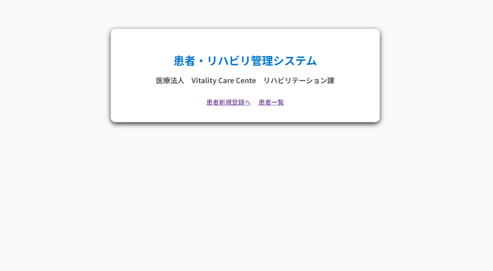
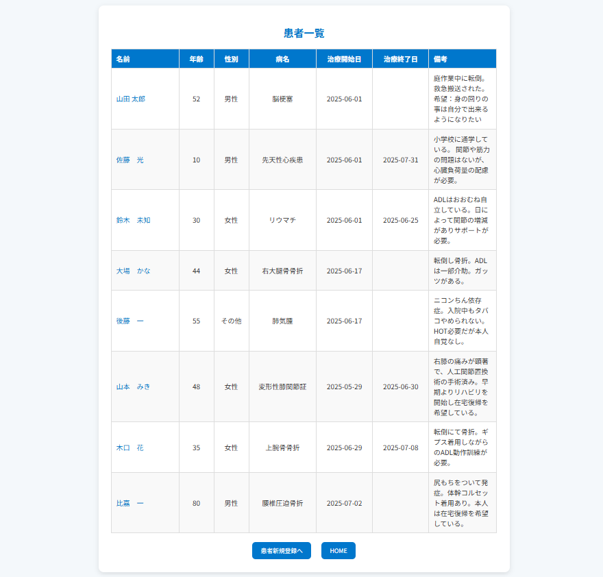
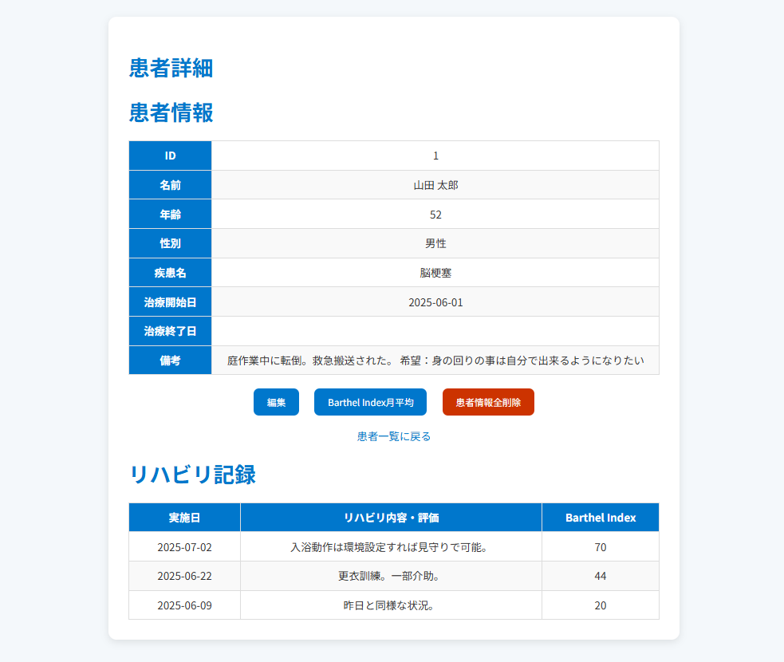
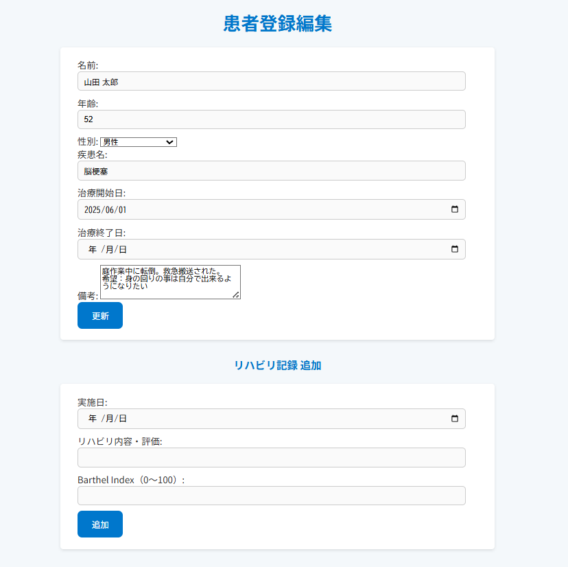
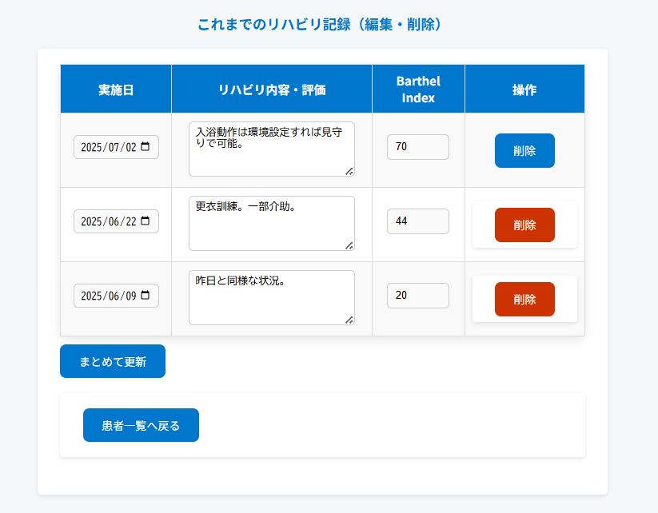
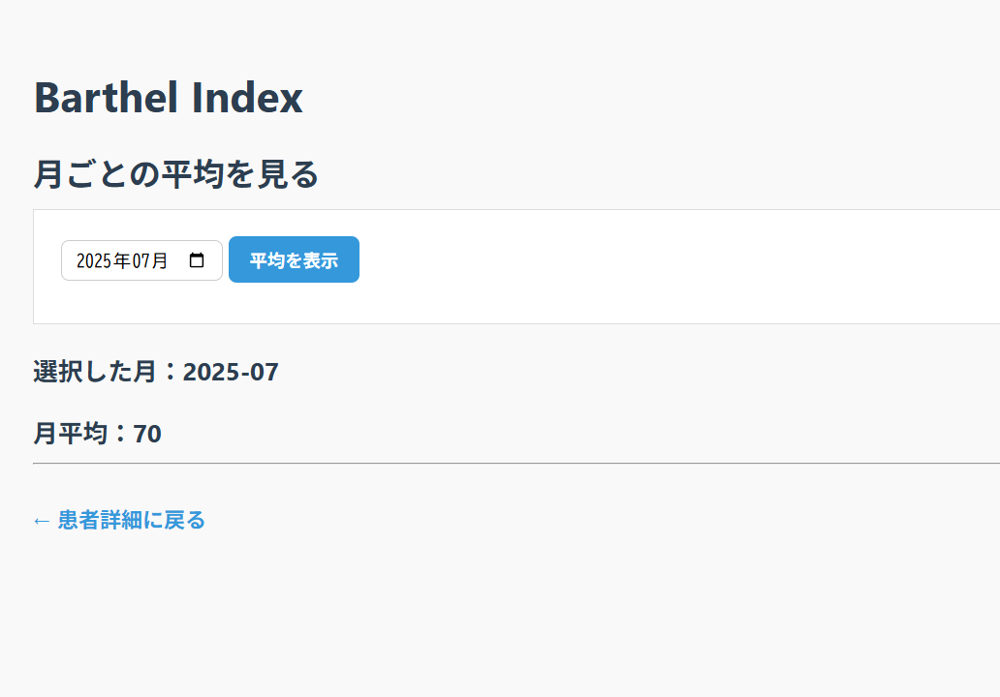

# 🩺 Rehab Management System

**患者のリハビリ記録とBarthel Indexを管理する  
シンプルで使いやすいWebアプリケーション。**

※「この病院名は架空のものであり、実在の病院とは関係ありません」




---

## 📖 サービスへの想い

患者ごとのリハビリ内容を手軽に記録・参照でき、
Barthel Indexの月ごとの平均値を自動で算出・表示することで、
状態の変化を把握しやすくしています。
また、誰でも直感的に使えるシンプルな操作設計にこだわり、
日々の記録作業や患者管理をスムーズに行えるよう工夫しました。

このアプリケーションを通じて、現場での情報共有や引き継ぎ、
評価作業の効率化に少しでも貢献できればと願っています。

---
※ Barthel Index（バーセルインデックス）とは？

日常生活動作（ADL）の自立度を10項目で評価し、
リハビリや介護の必要度を定量的に把握するための指標です。
食事、移動、排泄などの能力を数値化することで、
患者の回復状況や支援の必要性を把握するのに活用されます。


---

## 💡 開発の背景

介護・福祉の現場では、情報が紙やExcelでバラバラに管理されており、  
「過去のリハビリ内容が分かりづらい」「引き継ぎに時間がかかる」といった課題がありました。  
私自身の現場経験をもとに、**誰でも簡単に操作できる記録システム**を目指して開発しました。

---

## 🚀 プリケーションの主な機能や特徴

- ✅ 患者情報の登録・編集・削除
- ✅ リハビリ記録の追加・編集・削除
- ✅ Barthel Indexの月別平均計算・表示
- ✅ 操作完了を分かりやすく伝えるメッセージ通知
- ✅ Thymeleafによるシンプルで直感的な画面構成

---
## 🛠 使用した技術
| 技術           | バージョン / 概要                          |
|----------------|---------------------------------------------|
| Java           | 21                                          |
| Spring Boot    | 3                                           |
| MyBatis        | XML Mapper 使用                             |
| MySQL          | 患者・リハビリ情報の管理用DB               |
| Thymeleaf      | HTMLテンプレートエンジン                    |
| Maven          | ビルド管理                                  |
| JUnit / Mockito| 単体テスト・モックによるテストに使用       |
| IntelliJ IDEA  | メインの開発環境                            |
| Git / GitHub   | バージョン管理 / ソースコード公開           |
| Heroku         | アプリケーションのデプロイに使用            |
---

## 📷 画面と機能説明

### 🔸 患者一覧画面
- 登録済みの患者をリスト表示。
- 患者の名前を選択すると「詳細ページ」、「編集・削除」、「BarthelIndex月平均」にアクセス可能。  
  
  
### 🔸 患者編集・リハビリ記録追加登録・編集
- 各患者ごとに患者情報の編集、リハビリ内容の追加記録・編集の表示が一つのページでできます。 
- リハビリの編集は複数まとめて行えます。
  
  

### 🔸 Barthel Index管理画面
- ひと月を入力し、自動で月平均を計算  。
  

---

## 📊 ER図

  
※dbdiagram.ioやDrawSQLなどで作成した図をここに表示

---

## 🖧 インフラ構成図

  
例：ローカル → Spring Boot → MySQL（Docker環境なども可）

---

## 📈 今後の展望

- ユーザー認証機能の実装（ログイン・ログアウト）
- モバイル端末での操作性向上
- 患者検索機能 
- 管理者専用ログイン、編集画面。

---

## 👤 開発者

**na-tu**  
現場での業務経験を通じて、日々の業務や情報共有の中にもっと工夫ができる事を実感。  
「もっと手軽に、もっと便利に」作業できるアプリを届け多くの人の手助けになりたい思いから、ITエンジニアを志しました。  
特定の業界に限らず、あらゆる現場で困っていることや非効率な作業を、ITの力で解決できる仕組みを作ることを目指しています。  
その実現のため、日々知識とスキルの向上に取り組んでいます。

---

## 📂 Setup & Run（ローカル起動方法）

```bash
# リポジトリをクローン
git clone https://github.com/na-tu/rehab-system.git
cd rehab-system
